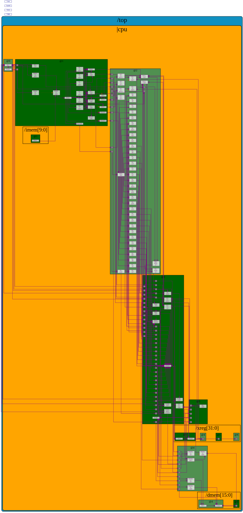
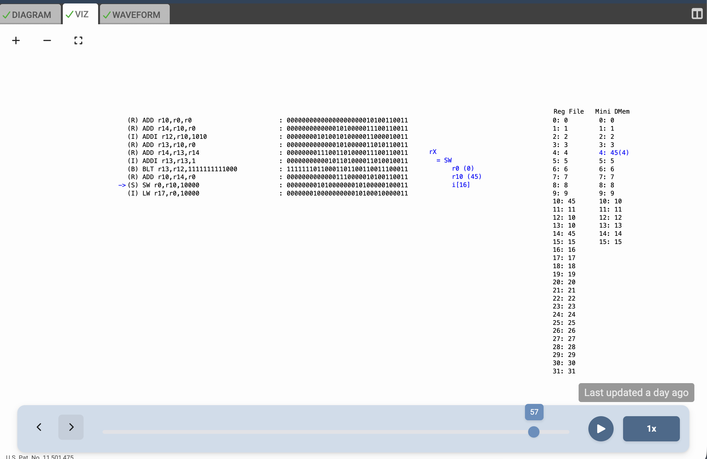
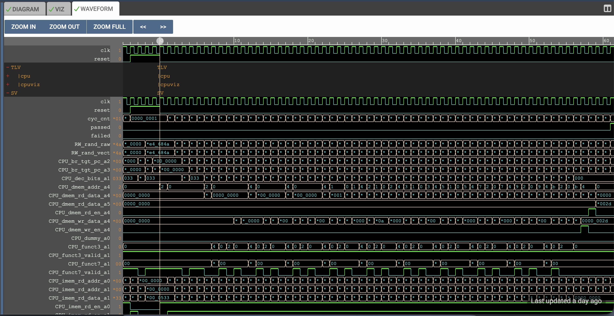

# 5-Stage Pipelined RISC-V CPU Core

This repository contains the complete implementation of a 5-stage pipelined RISC-V (RV32I) CPU core, designed using **TL-Verilog** and simulated in the **Makerchip IDE**.  
This project was developed as a hands-on exercise to understand the fundamentals of computer architecture, starting from a basic single-cycle design and evolving it into a fully pipelined processor.

- Link to the [Single-Cycle 32-bit RISC-V CPU Core Repository](https://github.com/Sandeep271958/RISC-V-CPU-Core)
  
- Link to the [Simulation](https://www.makerchip.com/sandbox/0R6frhvQ/0NxhN8) on **Makerchip IDE**.

---

## Table of Contents
- [Overview](#overview)
- [Key Features](#key-features)
- [Design Flow and Microarchitecture](#design-flow-and-microarchitecture)
- [Verification](#verification)
- [Simulation](#simulation)
- [FPGA Implementation](#fpga-implementation)
- [Performance](#performance)
- [References](#references)
- [Future Work](#future-work)
- [Acknowledgements](#acknowledgements)

---

## Overview
The primary goal of this project is to **design, implement, and verify** a functional RISC-V CPU that supports the base 32-bit integer instruction set (**RV32I**).  

The development process follows a logical progression from a simple single-cycle architecture to a more efficient **5-stage pipelined design**, showcasing the performance benefits of pipelining.



---

## Key Features
- **RV32I Base Instruction Set** – Implements all standard integer instructions (arithmetic, logical, memory access, branches, and jumps).  
- **5-Stage Pipeline** – Structured into the classic stages: Fetch, Decode, Execute, Memory, and Write-Back.  
- **Hazard Detection & Forwarding** – Includes a hazard unit to handle data hazards via forwarding and stalling.  
- **TL-Verilog** – Designed with TL-Verilog’s timing-abstract features to simplify pipelining.  
- **Makerchip IDE** – Developed and verified in a browser-based simulation environment.  

---

## Design Flow and Microarchitecture

The design was built incrementally, starting with a basic 3-stage model and evolving into the full 5-stage pipeline.

### 1. Basic CPU Microarchitecture (Fetch–Decode–Execute)
- **Fetch:** The Program Counter (PC) supplies an address to Instruction Memory, which outputs the instruction. The PC increments sequentially.  
- **Decode:** The instruction is broken into fields (opcode, funct3, funct7, registers, immediate values) to identify the operation.  
- **Execute:** The ALU performs the specified operation on operands read from the Register File.
  

### 2. Evolving to a 5-Stage Pipeline
To improve performance, the single-cycle design was expanded into a **classic 5-stage pipeline**.  
TL-Verilog’s `@` syntax was used to define pipeline stage boundaries.

```verilog
|cpu
   @1  // Instruction Fetch
      ...
   @2  // Instruction Decode & Register Read
      ...
   @3  // Execute
      ...
   @4  // Memory Access
      ...
   @5  // Write-Back
      ...
```


### 3. Handling Hazards
Pipelining introduces data and control hazards, which must be handled to ensure correct program execution.

- Data Hazards: These occur when an instruction depends on the result of a previous, unfinished instruction. Our design solves this with:

- Forwarding Unit: Results from the EX and MEM stages are forwarded directly to the ALU inputs, preventing unnecessary stalls.

- Stalling (Load-Use Hazard): When a load instruction is immediately followed by an instruction that uses the loaded data, the pipeline stalls for one cycle to allow the data to be retrieved from memory.

- Control Hazards: These occur with branch and jump instructions. The pipeline implements logic to flush incorrect instructions fetched after a taken branch and redirects the PC to the correct target address.
  

##  Verification
The processor's functionality was verified in the Makerchip IDE using a test assembly program that calculates the sum of numbers from 1 to 9. The test program checks if the final sum (45) is correctly written to register r10. The simulation confirms this by asserting *passed when the condition is met.

```verilog

  // Test case assertion
  *passed = |cpu/xreg[10]>>5$value == 45;

```

The visualization below shows the final state of the register file after the program has completed, with r10 holding the value 0x2d (45).




## Simulation
The CPU was implemented and simulated using the Makerchip IDE. Makerchip provides interactive datapath visualizations (VIZ) and waveform outputs for debugging and verification.

To try it yourself:
- Open the TL-Verilog file in the Makerchip IDE.
- Click Compile & Simulate.
- View the VIZ window for the datapath execution and the Waveform window for signal-level details.
- The simulation runs a test program that exercises the RV32I instruction set, demonstrating correct fetch, decode, execute, memory, and write-back stages.
- Link to the [Simulation](https://www.makerchip.com/sandbox/0ADf9hZK/0j2hYYy#) on **Makerchip IDE**.


## Waveforms



## FPGA Implementation
- HDL: TL-Verilog

- Simulation: Makerchip IDE

- FPGA Synthesis: Xilinx Vivado (for hardware deployment)

- Target Hardware: Nexys A7 FPGA Board (or similar)
  

### FPGA Implementation Results
The CPU was successfully synthesized for a Xilinx Nexys A7 FPGA.  
The post-synthesis performance and resource utilization estimates are:  

- **Maximum Clock Frequency:** ~125 MHz  
- **Slice LUTs:** ~1,300  
- **Flip-Flops:** ~650  


## Performance

| Metric                | Pipelined Core | Single-Cycle Core |
|-----------------------|----------------|-------------------|
| Cycles (Test Program) | 62 cycles      | 34 cycles         |
| Clock Period          | ~8 ns          | ~21 ns            |
| Clock Frequency       | ~125 MHz       | ~47 MHz           |
| Total Time Taken      | 496 ns         | 714 ns            |

- Speedup Obtained: ~1.44x
  

## References
- RISC-V ISA Specification

- Digital Design and Computer Architecture, RISC-V Edition – David Harris & Sarah Harris
  

## Future Work
- Adding More Extensions: Extend the core to support other RISC-V extensions, such as multiplication and division (M-extension).

- Cache and Memory System: Integrate a cache hierarchy to improve memory access performance.

- Implement branch prediction to improve pipeline efficiency.
  

## Acknowledgements
This project was developed based on the curriculum and labs from the "Building a RISC-V CPU Core (LFD111x)" course provided by The Linux Foundation and edX. and workshop titled ‘RISC-V based Microprocessor for You in Thirty Hours (MYTH)’, that was about designing RISC-V core using TL-Verilog organized by Steve Hoover.
